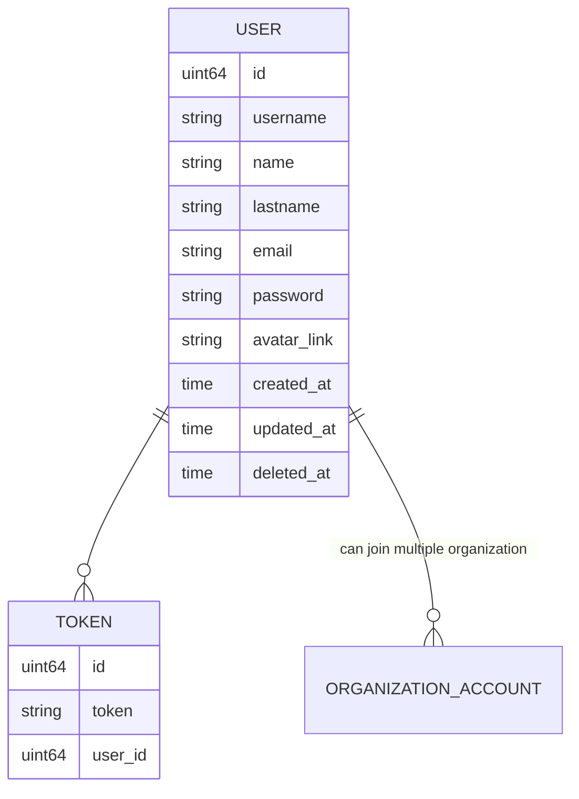
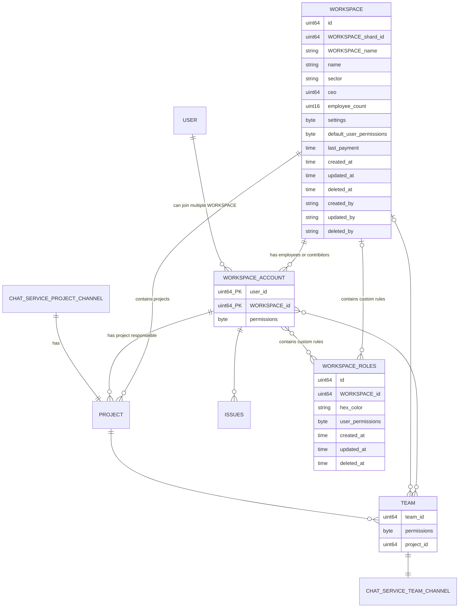

# Project Management System 

Project Management System is a tool that helps working with multiple project management methodologies. 


## Main Goals
Project management system should isolate complexity of all project from contributers and employees. It should also provide flexibility. But this flexibility should not risk the simplicity of structure. 
- Organization users should be managed easily and isolated by teams. Users inherit permission from organization and team. Also they can have custom permission can give by super users. This provides hiding unecessary sections and tasks from user, also prevents unauthorized creating, update, deletions. And inheritance provides easy general permission changes.
- Roadmap of the project and team responsibilies must be clear. Every teams is associated with execution group. This groups includes execution plans. This plans can be sprint or other types.
- Complex projects should seperate to multiple simple parts. And this parts can include hierachical parent parts. This parts are sections. 
- Documentation is important part of projects. Every section can include its own embeded documentation file. Users can route between this files by sidebar.
- Every task is assocaited by a section. And best practice is every task should be related with a one meaningful section.
- Tasks should have dynamic fields. And this dynamic field types are predefined structure with server and frontend logic. This fields can be required or nullable
- Tasks should have static default fields. Every task will include them.
- Sections can include multiple view types. Also this views can be filtered, ordered by fields. Users can select which field will be display or hide
- Authorized users can create reports with multiple chart types. Reports can be filtered, ordered by fields. Users can select which fields will be displayed. This part has similarity with views. But reports are only read only.Reports cant manuplate the data. But it can include charts with historical data, which views cannot do. 
- PMS will be include chat service.
- Every user can have favorite sections or tasks for easy access.
- PMS will be include notification service

## Features
### Account

Users need to create an account to use this application. This account includes:
- username [required, min:1 max: 24]
- password [required, min:1, max: 48]
- name [required, min:1, max: 48]
- lastname [required, min:1, max: 48]
- avatar_profile_picture [default: random default picture]
- email: [required, email_format]
- telephone : [nullable, format telephone no] (for two factor authentication)

### Workspace 
Workspace is the main working environment of an organization. Includes teams, permissions, workspace accounts, chat and notification channels, predefined templates, roles. Workspace is a reflection of the organizational structure of company or group. But workspace abilities takes shape with selected application plan.

- organization_name [required, min:1, max: 48]
- avatar_picture [default: random default picture]
- organization_super_user
- settings
- default_member_permissions [organization:gur(hides settings)d, project:gcrud, section:gcrud, task:gcrud, view:gcrud, report:gcrud, automation:gcrud, execution_plan:gcrud, chat:gcrud, team:gcrud] (g:general_access, c: create, u: update, r: read, d: delete). Also this permissions has static logic groups. If user can update or delete project, at the same time user has a permission automaticly for section and task update or delete process. Same thing avaible for section. For read operations this works in reverse. If user read section, user can display  projects. This permissions can be general or it needs to associatied with section or project
- application_plan [required, default free]
- last_payment_date [nullable]

### Workspace Roles
Workspace roles structure is like wokspace default member permissions.Its function is groups permissions by member roles. Default organization roles are not changeable on workspace roles. Workspace roles can only manage addtional permissions. If a permission is not general workspace account needs to be assoicated with projects or sections for execute this permissions.

- name [required, min:1, max: 48]
- hex_color [required: min:1 max: 6]
- permissions

### Workspace Account
Every user needs workspace account for join workspace. This account includes role associations, favorites, projects, section associations and salary.

- permissions
- salary

### Team 
Workspace accounts can group by teams. Every team has own chat channel. Team Leader can change team name, description and members or another user with permissions can update team properties.

- name [required, min:1, max: 48]
- desciptrion [nullable, min:1, max: 512]
- members


### Diagram of User Service Database (postgresql):

settings example: Work in progress limit, 

### Diagram of Organization Service Database (postgresql??):




### Project: Main Project Management Structure
Project is an independent whole and an integrated state of the main goals with plans. It includes sections, subsections, execution groups, execution plans, tasks, reports, views,
- Name : Name of the project. Every organization-name combination must be uniqeu.    [Min:1 Max:48 Required, unique(organizationId,name)] 
- Code: Short project code name without spaces and numbers [Min:1,Max:18, Required]
- Description: Summary of the project [Min:1,Max:255 Required]
- Documentation File: Detailed documentation of the project. It will be store project details with a basic CMS service. With using CMS service, user can create complex navigation structure around multiple files and contents. CMS service will create a folder for every project and create pages inside that.
- Project Settings: Settings of the project. It will store as binary format.
- Views: User defined view structures
- Automations: User defined automations
- Organization: Organization to which the project belongs [Required]
- Project Responsible : Super user of project. Has all create update and get permissions [Required, default=created_user]
- Start Date: Project planned start date [Required]
- Due Date: Project planned end date [Required]
- TaskLabels[]: Project based custom labels for tasks.

### ExecutionGroup: Group Of Execution Plan
- Name: Defined name of execution plan[Min:1 Max:48 Required]
- Description: Defined name of execution plan[Min:1 Max:48 Required]
- TotalStoryPoints: total defined story points

### ExecutionPlan: Task execution scheduling
The execution plan defines which task will be executed between in time interval
- Name: Defined name of execution plan[Min:1 Max:48 Required]
- ExecutionGroup: Group of execution plan. [Required]
- Status: Is activation plan activated?
- Type: Type of execution plan [Sprint, etc.]
- Start: Sprint start time. [Required]
- End: Sprint end time [Required]
- TotalStoryPoints: total defined story points

### Section: Subtract Task Groups of The Project
The section describes all task groups created for meet the requirements of the project. It can be a main feature of the project. Or it may be a transactional process that contributes to the project (marketting is an example)
- Title: Title of section [Min:1 Max:48 Required]
- Description: Summary of the section[Min:1,Max:255 Required]
- SectionType: Section types defined inside code as enum [TaskGroup, SectionGroup, Marketing, UserStory]
- DocumentationFile: Stores id of markdown file document id. Documentation Service is managint this procedure
- Project: Subject's project [Required]
- ParentSection: Parent of the section [Required]
- TaskLabels[]: Section based custom labels for tasks.
- TaskFields[]: Section based custom fields for tasks. All custom fields can define with keyword this keywords defined inside code
- Views[]: User defined view structures can created by defined templates inside service logic.
```
custom_fields : {
	select: [{
		field_name: string,
		options: [
			_id: int
			name: string,
			color: string(hexCode)
		]
	}],
	money: [{
		name: string
		currencyCode: int
	}],
	text: [{
		name: string
	}],
	textarea: [{
		name : string
	}],
	number : [{
		name: string
	}],
	multiselect: [{
		field_name: string,
		options: [
			_id: int
			name: string,
			color: string(hexCode)
		]
	}],
	calculation :[
		(not designed)
	],
	member: [{
		name: string
		selectMultiple: boolean
		includeTeams: boolean
	}],
	autoProgressBar: [{
		name: string,
		watchToParameters: number (subtasks, checklists, subtasks or checklists)
		
	}],
	manualProgressBar: [{
		name: string,
		min: number,
		max: number
	}],
	date:[{
		name: string
	}]
	urlLink:[{
		name: string
	}],
	checkBox:[{
		name: string
	}],
	mailLink:[{
		name: string
	}],
	files:[{
		name: string
	}]
	phones:[{
		name: string
	}]
	locations:[{
		name: string
	}]
}
```

### Task
Task the main element of the project. It is the most numerous structure in the system.
- IssueId
- Name: Name of the task [Required Min:1, Max:48]
- Description [Required Min:1, Max:255]
- Documentation Files (Optional)
- StoryPoint: Story point is a optional select field [Optional]
- TimeProgress: TimeProgress is manual progress bar. It stores total minutes. But minutes will be formatted to datetime before show to user. It is alternative of story point
- Labels: Selected labels form section or project based defined options. It is multiselect type
- Status: Satatus of the task selected form section or project based defined options. It is select type
- TaskDependency: 


|Project | Parent Section | Section | Parent Issue | Issue |Child Issues|
|-|-|-|-|-|-|
Project Management Application | Project Module | View System | View Creation Pages| Kanban View Creation Page | Kanban View Creation Page Design / Input Component Creation / Form Creation        |
|

Issue Dependecy Types : child of, blocker of,new version of, new feature of , Finish to start (FS), Finish to finish (FF), Start to start (SS), Start to finish (SF)
Section Dependecy Types : child of, new version of, next stage of, Finish to start (FS), Finish to finish (FF), Start to start (SS), Start to finish (SF)


#### Diagram of Project Service Relational Schema:
```mermaid
erDiagram  
 PROJECT {
	uint64 id
	string name
	sting description
	string documentation_file_id
	byte settings
	jsonb views
	jsonb automations
	uint64 organization_id
	uint64 project_responsible_id
	string scope_rules
	money budget
	time start_date
	time due_date
	time created_at
	time updated_at
	tiem deleted_at
 }
ORGANIZATOIN ||--o{  PROJECT: "has"
ORGANIZATION_ACCOUNT }|--o|  PROJECT: "project responsible" 
CONTENT_SERVICE||--||  PROJECT: "documentation file" 
HISTORY_SERVICE||--||  PROJECT: "project change history" 

EXECUTION_PLAN {
	uint64 id
	uint64 name
	uint64 project_id
	money budget
	uint8 status
	uint8 sprint_queue_number
	time start
	time end
}

PROJECT ||--o{  SECTION : "has"
SECTION ||--o{  VIEWS : "has"

SECTION |o--o{ ISSUES:"has"
EXECUTION_PLAN }o--o{ ISSUES:"has"

PROJECT ||--o{ EXECUTION_GROUP : ""
EXECUTION_GROUP ||--o{ EXECUTION_PLAN: ""

SECTION ||--o{  SECTION : "has child SECTION "

SECTION ||--o{  LABELS_OPTIONAL : "has child SECTION "

LABELS_OPTIONAL {
	string name
	string colorHex
	
}

ISSUES ||--o{  NOTES: ""
ISSUES ||--o{  NOTES: ""
ISSUES ||--||  ISSUE_CHAT_SERVICE: ""

ISSUES {
	ID uint64  
	Title string  
	Description string  
	IssueForeignId string  
	TargetTime uint32  
	SpendingTime uint32  
	Progress uint8  
	Impact uint8
	Label uint8
	Status uint8
	uint8 height 
	SECTION SECTION 
	ProjectID uint64  
	StatusID uint8 
	Worklogs jsonb
	Notes jsonb
	Checklist jsonb
	DependentIssues Issue 
	ReporterID uint64 
	Reporter User 
	AssignieID uint64  
	Assignie User 
	DueDate time
	CreatedAt timeTime 
	UpdatedAt timeime 
	DeletedAt gormDeletedAt 
}

ISSUES ||--o{ WORKLOG : ""

ISSUES ||--o{ CHECKLIST: ""


ISSUES ||--o{  ISSUE_DEPENDECY : "has issues"
ISSUES ||--o{  ISSUE_DEPENDECY : "has dependent issues"
ISSUE_DEPENDECY {
	uint64_PK issue
	uint64_PK dependentIssue
	uint8_ENUM_PK dependencyType
}

SECTION {
	ID uint64 
	Title string 
	Description string
	string documentation_file_id
	ProjectID uint64  
	color st
	Project Project 
	Issues Issue 
	CreatedAt timeTime 
	UpdatedAt timeTime 
	DeletedAt gormDeletedAt 
}

TEAM_MEMBERS ||--o{ ISSUES : ""

WORKLOG {
	uint64 id
	uint8 spending_time
	string log
	checklists:[{
		_id
		name
		checklist_elements:[{
			_id
			name
		}]
	}]
	time createdAt
	time updatedAt
	time deletedAt
	uint64 log_owner
}

NOTES {
	uint64 id
	uint64 issue_id
	string comment
	uint64 created_by
}

CHECKLIST{
	uint64 id
	string name
	boolean checked
}

```

#### Worklog json
```
WORKLOG {
	uint64 id
	uint8 spending_time
	string log
	time createdAt
	time updatedAt
	time deletedAt
	uint64 log_owner
}
```

#### Notes json
```
NOTES {
	uint64 id
	uint64 issue_id
	string comment
	uint64 created_by
}
```

#### Checklist json
```
CHECKLIST{
	uint64 id
	string name
	boolean checked
}
```


### Project schema example (mongodb version)
```
project_collection:

{
  ...project_fields
  executıon_plans: [
    {
      ...execution_plan_fields,
    }
  ],
  sections: [
    {
      ...section_fields,
      dependent_issues: [{
        _id
        name
      }]
    }
  ],
  issues: [
    {
      _id
      ...issue_fields,
      dependent_issues: [{
        _id
        name
      }]
      section : {
        _id
        name
      }
      executionPlanName: {
        _id
        name
      }
    },
	  worklog : [{}]
	  notes: [{}]
	  checklist: [{}]
	  history: []
 
```
Issue Collection
```
 issues: [
    {
      _id
      ...issue_fields,
    waiting_tasks:[{
	      id:
	      name: string,
	}],
	blocking_tasks:[{
	      id:
	      name: string,
	}],
	related_tasks:[{
	      id:
	      name: string,
	}],
	childTasks:[{
	      id:
	      name: string,
	}]
    section : {
        _id
        name
      }
      executionPlanName: {
        _id
        name
      }
    },
	  worklog : [{}]
	  notes: [{}]
	  checklist: [{}]
	  history: []
 
```

### View Slot System (Kanban, Gantt vs)
Every view has an predifined slot structures inside code. And user can define which parameters will be part of this structure. With an frontend interface user can design which parameters show where. Service will control this definations match with schema limitations, and save this structure as json format inside view structure. All keys are reserved and validated keywords.

#### Example View Format :
```
{
	uint64 id
	string name
	jsonb view_structure
	uint64 userID
	date created_at
	date updated_at
}
```
#### Example Kanban View Format
```
{
	grouping_field: field_name
	title : [
		project_issue_id
		issue_name
	]
	upright_corner: [
		assinie_image: url
		assignie_name
	],
	bottomright_corner : [
		due_date: 
		
	],
	bottomeleft_corner : [
	
	],
	line_percentage: {
		(total_checkount)
		(checked_check_count)
	}
	description_paper:{
		title : [
			project_issue_id
			issue_name,
		]

	}
}
```
#### Example List View Format
```
	column_list:[
		issue_name
		issue_due_date
		issue_priority
		etc...
	]
```

### Automation Service

Automation service will include trigger, control and effect properties. Trigger is describes to events starting the process. And effects describes the process after trigger happend. Every possible trigger and effect described inside code. Also triggers can connect each other "or" combiners. When trigger event published, target fields controlled by control layer. This layer includes chained statements by "and" or "or". After that mulpile effects can run if all controls passed. If automations are enabled, this automations added to automation service redis cache. When event triggered project service will send request to automation service. Then automation

#### Diagram of Automaton Service Database (mongodb):

```
{
	_id
	project_id
	triggers: []
	controls: []
	effects: []
}
```

### Notification Service

### Report Service
Reports will created by different view widgets. All this widgets have filters and different view styles.
Example widget setting data 

```
{
	_id
	components:[{
		type: "piechart"
		locationStart: {x:0,y:0}
		locationEnd : {x:8, y:8},
		filters: [{
			field:"status",
			control: "eq"
			value: 1
		}]
	},{
		type: "columnchart"
		locationStart: {x:8,y:1}
		locationEnd : {x:11, y:9},
		
	}
	]
	
}
```

## Technical Notes

### User Permission System

When user logged in, user will get organization permissions from ORGANIZATION_ACCOUNT table and team permissions from TEAM_MEMBER table for  token. Also user will get defaut role permissions from TEAM_MEMBER_ROLE table
ORGANIZATION_ACCOUNT permissions.

rwud = read write update delete. chmod like permission system 
Examples:
 0010 = 2 update
 1100 = 12 read and write
 **Note:** write permission also can update if entity created by same user. But with update permission user can update another entitys wich created by another organization members.

- organizationID:0(issue):rwud - organization based global issue permissions
- organizationID:1(project):rwud - organization based global project permissions
- organizationID:2(section):rwud - organization based global section permissions- 
- organizationID:3(sprint):rwud - organization based global sprint permissions
- organizationID:4(organization):rwud - organization based global organization permissions

- projectID:0(issue):rwud - project based global issue permissions
- projectID:1(project):rwud - project based global project permissions
- projectID:2(section):rwud - project based global section permissions
- projectID:3(sprint):rwud - project based global sprint permissions

### Posgres scaling

We will scale project database by project based. Looks like this example https://www.notion.so/blog/sharding-postgres-at-notion

I decide to test sharding structure with 
|Physical db 1                          |Physical db 2       |
|-------------------------------|-----------------------------|
Logical Shard 1          | Logical Shard 1             |
Logical Shard 2              |Logical Shard 2            |
And also, i need to create shard mapping file for physical databases
drdkkan7uub4l -> project_shard_id -> 1
drdkkan7uub5l -> project_shard_id -> 2

When user getting permissions from organization service also get informantion of which shard includes organization projects. This information will be store inside the redis cache. If cache not include this data, user can get project_shard_id from organization service

## Chat Service Specs
- Every project and team has a chat group.
- Inside this chat groups members create sub channels for sections or issue. 


## Documentation Service

Content Service is a service for project, section or issue documentation.  This service can store markdown files as pages or nested pages. Also this schema

### Shema of Content Service Pages (Mongodb)
documentation_collection example
```
{
	_id
	name
	markdownFileSource
	parts: [{
		id
		name
		markdownFileSource
	}]
	navtree_id
	createdAt
	updatedAt
	deletedAt
	createdBy
	updatedBy
	deletedBy
}
```

nav_tree collection example
```
	_id
	pages: [{
		id
		name
		documentation_id
		pages:[{
			id
			name
			documentation_id
		}]
	}]
```

### Logger Service

Logger service will use mongodb for storing logs. With this way accesing log data will be more easy.  
Example general logging schema will be this way generally.
```
{
  level
  datetime
  request_id
  service_id
  user_id
  message_id
  (and more optional fields)
}
```
Every service and subparts will have their own collection.

### History Service 

This service is similar with logger service. But it includes less detail and data then user service. And stores data which we want to show users with history pages. Isseues, sections, sprint and issues have history pages.

Example Issue History Collection:
```
{
  responsible_id
  responsible_name
  action
  date
}
```
