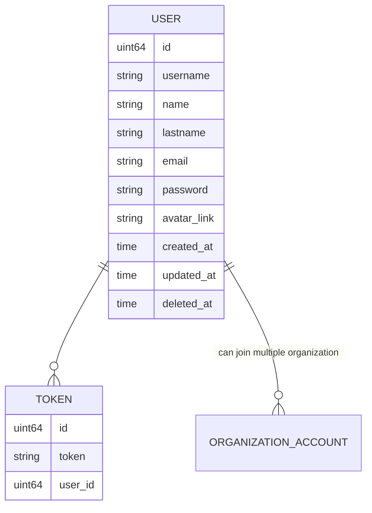
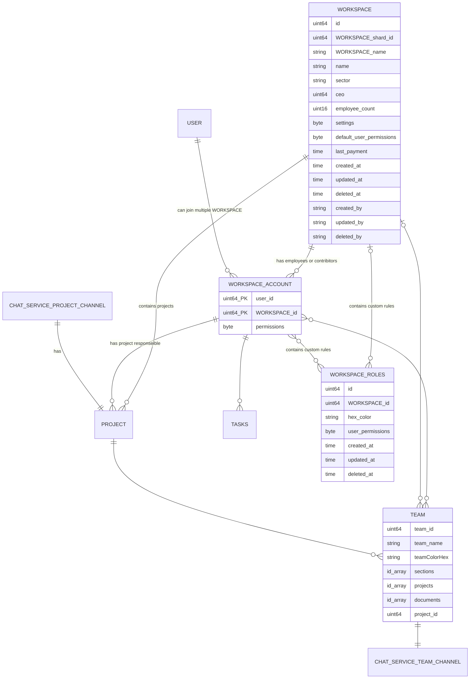

# Project Management System 

Project Management System is a tool that helps working with multiple project management methodologies. 

## Screen Designs
https://www.figma.com/file/YIhfMQM4mA2Lji5fguLzQm/NonEx-IntegratedTaskManagement?node-id=380%3A129

## Microservice High Level Design 
https://drive.google.com/file/d/1RwU5d8xTOaOcD4QBwGgX9Y6GRsTC89jW/view?usp=sharing


## Main Goals
Project management system should isolate complexity of all project from contributers and employees. It should also provide flexibility. But this flexibility should not risk the simplicity of structure. 
- Organization users should be managed easily and isolated by teams. Users inherit permission from organization and team. Also they can have custom permission can give by super users. This provides hiding unecessary sections and tasks from user, also prevents unauthorized creating, update, deletions. And inheritance provides easy general permission changes.
- Roadmap of the project and team responsibilies must be clear. Every teams is associated with execution group. This groups includes execution plans. This plans can be sprint or other types.
- Complex projects should seperate to multiple simple parts. And this parts can include hierachical parent parts. This parts are sections. 
- Documentation is important part of projects. Every section can include its own embeded documentation file. Users can route between this files by sidebar.
- Every task is assocaited by a section. And best practice is every task should be related with a one meaningful section.
- Tasks should have dynamic fields. And this dynamic field types are predefined structure with server and frontend logic. This fields can be required or nullable
- Tasks should have static default fields. Every task will include them.
- Sections can include multiple view types. Also this views can be filtered, ordered by fields. Users can select which field will be display or hide
- Authorized users can create reports with multiple chart types. Reports can be filtered, ordered by fields. Users can select which fields will be displayed. This part has similarity with views. But reports are only read only.Reports cant manuplate the data. But it can include charts with historical data, which views cannot do. 
- PMS will be include chat service.
- Every user can have favorite sections or tasks for easy access.
- PMS will be include notification service

## Project Philosophy and Core Structure (DPECA)

workspace contains all elements. 
* Desing (target)
	- project
	- section
	- task
	- document
	- attachments 
* Plan (target + time)
	- Execution groups
	- Execution plans
* Execute - Communicate (target + time + human)
	- team
	- chat service
	- worklog
	- notes
	- history
* Analyse (target + time + human + progression)
	- reports
	- views,
	- dashbaords

## Section Structure of the Project

* Features
	- User
		- Register
			- -Register Service
			- Email verficiation
				- -Email verfication screen (web)
				- -Unlock account service
			- -Register Screen (web)
		- Login
			- User Login Service
			- User Login Screen
		- -Two Factor Authentication (Not designed yet)
		- -Password change
			- Password Change Component (web)
			- Password Change Service
		- -Add Profile Picture
	- Audit
		- User Audit Notification Settings
			- Settings Edit Component (web)
			- User Enable Notification Service
			- User Notifications Filter Middleware
			- Kafka notifications subscribe model
		- Audit Task
			- Audit Task Service
			- Audit Task Component
	- Workspace 
		- Workspace Creation
			- Workspace create service
			- Workspace create form component(web)
		- Workspace Deletion
			- Workspace delete service
			- Workspace delete frontend implementation (web)
		- Settings
			- Organization Name Change
				- Organization Name Update Service
				- Oganization Name Update Component (web)
			- Permission
				- Permission Mode Change Service
				- Permission Mode Change Component (web)
		- Plan And Billing (not designed yet)
		- Member Management
			- Get members for list service
			- Workspace members component (web)
			- Manage Member Role component (web)
			- Manage Member Non-Standart Permissions component (web)
			- Manage Member Non-Standart Permissions service
			- Manage Member Assigned Sections component(web)
			- Manage Member Assigned Sections service
					
		
* Frontend Specific (web) 	
	- Monolith Frontend Service 
		- components
			- Inputs
				- TextInput
				- TextAreaInput
				- SelectInput
				- MultiselectInput
				- ImageSelection
				- CheckboxInput (Toggle Switch)
				- SwitchInput
		- pages
			- Settings Pages
				- Settings Layout And Navigation
				- -User Settings Page
				- -User Notifications Page
		- configrations
			- docker file creation


* Backend Specific
	- User Microservice
		- Request Validation Structure
		- Database Connection
		- docketfile creation
	- Notification Microservice
		- Kafka Implentation and Configration

* Pipeline Specific

## Features
### Account

Users need to create an account to use this application. This account includes:
- username [required, min:1 max: 24]
- password [required, min:1, max: 48]
- name [required, min:1, max: 48]
- lastname [required, min:1, max: 48]
- avatar_profile_picture [default: random default picture]
- email: [required, email_format]
- telephone : [nullable, format telephone no] (for two factor authentication)

### Workspace 
Workspace is the main working environment of an organization. Includes teams, permissions, workspace accounts, chat and notification channels, predefined templates, roles. Workspace is a reflection of the organizational structure of company or group. But workspace abilities takes shape with selected application plan.

- organization_name [required, min:1, max: 48]
- avatar_picture [default: random default picture]
- organization_super_user
- settings
- application_plan [required, default free]
- last_payment_date [nullable]

### Workspace Roles
Workspace roles structure is like wokspace default member permissions.Its function is groups permissions by member roles. Default organization roles are not changeable on workspace roles. Workspace roles can only manage addtional permissions. If a permission is not general workspace account needs to be assoicated with projects or sections for execute this permissions.

- name [required, min:1, max: 48]
- hex_color [required: min:1 max: 6]
- permissions[]

### Workspace Account
Every user needs workspace account for join workspace. This account includes role associations, favorites, projects, section associations and salary.

- permissions
- salary

### Team 
Workspace accounts can group by teams. Every team has own chat channel. Team Leader can change team name, description and members or another user with permissions can update team properties.

- name [required, min:1, max: 48]
- desciptrion [nullable, min:1, max: 512]
- members


### Project: Main Project Management Structure
Project is an independent whole and an integrated state of the main goals with plans. It includes sections, subsections, execution groups, execution plans, tasks, reports, views,
- Name : Name of the project. Every organization-name combination must be uniqeu.    [Min:1 Max:48 Required, unique(organizationId,name)] 
- Code: Short project code name without spaces and numbers [Min:1,Max:18, Required]
- Description: Summary of the project [Min:1,Max:255 Required]
- Documentation File: Detailed documentation of the project. It will be store project details with a basic CMS service. With using CMS service, user can create complex navigation structure around multiple files and contents. CMS service will create a folder for every project and create pages inside that.
- Project Settings: Settings of the project. It will store as binary format.
- Views: User defined view structures
- Automations: User defined automations
- Organization: Organization to which the project belongs [Required]
- Project Responsible : Super user of project. Has all create update and get permissions [Required, default=created_user]
- Budget: Budget of the project [money, Optional]
- Start Date: Project planned start date [Required]
- Due Date: Project planned end date [Required]
- CustomFields[]: Project based custom fields for tasks.

### ExecutionGroup: Group Of Execution Plan
- Name: Defined name of execution plan[Min:1 Max:48 Required]
- Description: Defined name of execution plan[Min:1 Max:48 Required]
- Budget: Execution budget [manuelProgressCustomFieldType]
- TotalStoryPoints: total defined story points [Optional]

### ExecutionPlan: Task execution scheduling
The execution plan defines which task will be executed between in time interval
- Name: Defined name of execution plan[Min:1 Max:48 Required]
- ExecutionGroup: Group of execution plan. [Required]
- Status: Is activation plan activated?
- Type: Type of execution plan [Sprint, etc.]
- Start: Sprint start time. [Required]
- End: Sprint end time [Required]
- Budget: Execution budget [manuelProgressCustomFieldType]
- TotalStoryPoints: total defined story points  [Optional]

### Section: Subtract Task Groups of The Project
The section describes all task groups created for meet the requirements of the project. It can be a main feature of the project. Or it may be a transactional process that contributes to the project (marketting is an example)
- Title: Title of section [Min:1, Max:255 Required]
- Description: Summary of the section[Min:1,Max:255 Required]
- SectionLabel: Section labels categorize sections [TaskGroup, SectionGroup, Marketing, UserStory]
- SectionRoleRequirements[]:  Describes which role required for executing task.
- DocumentationFile: Stores id of markdown file document id. Documentation Service is managint this procedure
- Project: Subject's project [Required]
- ColorCode: Sections color code for display [Required]
- ParentSection: Parent of the section [Required]
- TaskFields[]: Section based custom fields for tasks. All custom fields can define with keyword this keywords defined inside code
- Views[]: User defined view structures can created by defined templates inside service logic.
- SectionDependency: Dependency to another section [Waiting, blocking, related]

### Custom Fields: User Defined Field Values
Custom fields one of the most important things giving flexibilty the project. User can define extra fields for the task or they can override predefined fields. There are multiple custom field types. This custom field types provided by service logic. User can create section or project based custom fields by this predefined structures.  
If user wants to create custom field all parent element fields will be displayed to user.  This will prevent recreating previously created usable custom fields.

```
custom_fields : {
	select: [{
		field_name: string,
		options: [
			_id: int
			name: string,
			color: string(hexCode)
		]
	}],
	money: [{
		name: string
		currencyCode: int
	}],
	text: [{
		name: string
	}],
	textarea: [{
		name : string
	}],
	number : [{
		name: string
	}],
	multiselect: [{
		field_name: string,
		options: [
			_id: int
			name: string,
			color: string(hexCode)
		]
	}],
	calculation :[
		{
			method:"sum",
			parameters=
		}
		(not designed)
	],
	member: [{
		name: string
		selectMultiple: boolean
		includeTeams: boolean
	}],
	autoProgressBar: [{
		name: string,
		watchToParameters: number (subtasks, checklists, subtasks or checklists)
		
	}],
	manualProgressBar: [{
		name: string,
		min: number,
		max: number
	}],
	date:[{
		name: string
	}]
	urlLink:[{
		name: string
	}],
	checkBox:[{
		name: string
	}],
	mailLink:[{
		name: string
	}],
	files:[{
		name: string
	}]
	phones:[{
		name: string
	}]
	locations:[{
		name: string
	}],
	...3rdPartyImplementationDataTypes
}
```

### Task
Task the main element of the project. It is the most numerous structure in the system. Also it should include most dynamic features. 

#### Use Cases
- If users have permission, they can create tasks with required field
- Users can select and add addtional custom fields or they can create section or project based custom fields (if they have permission for that) before select custom field.
- Users can display tasks in multiple views with filters or selected values. Also they can edit this fields by view.
- Users can display task details inside another screen
- Task details includes view-edit fields for all task fields. Also it includes notes, worklogs, checklists and history.
- Multiple permitted users can assign one task and multiple permitted users can be auditor of the task. But for best practices it must be one.

#### Fields
- TaskId
- ProjectBasedId
- Name: Name of the task [Required Min:1, Max:255]
- Description [Required Min:1, Max:1023]
- Documentation Files (Optional)
- StoryPoint: Story point is a optional select field [Optional]
- TimeProgress: TimeProgress is manual progress bar. It stores total minutes. But minutes will be formatted to datetime before show to user. It is alternative of story point
- TaskRoleRequirements[]:  Describes which role required for executing task.
- Labels: Selected labels form section or project based defined options. It is override with multiselect type
- Status: Status of the task selected form section or project based defined options. It is select type
- Type: Task type. Is task, issue, epic or event()
- Priority: Task priority. It is select type
- TaskDependency: Dependency to another task [waits(b finished after a finished), blocks[b started after a finished], related, duplicate of]
- ParentTask: Parent task [Optional]
- ChildTaskCount: If it has child tasks child task count [Optional]
- Checklist: [Optional]
- Notes[]: Important notes about task [Optional]
- Worklog[]: Progression by story points or spending time with description
- Auditors[]: Auditors of the task [nullable]
- Assignies[]: Assignies of the task [nullable]
- Helpers[]: Helpers help assignees. In real life example, this corresponds to the senior assisting the junior. Senior can log this work as a helper.
- TaskStartDate: Describes start date of the task. It is independent from estimated time at the time progress.
- TaskEndDate:Describes end date of the task. It is independent from estimated time at the time progress.
- DueDate: 
- CreatedAt
- CreatedBy
- UpdatedAt
- UpdatedBy
- DeletedAt
- DeletedBy
- ...CustomFields [Optional]

#### Example Hierarchy
|Project | Parent Section | Section | Parent Task| Issue |Child Task|
|-|-|-|-|-|-|
Project Management Application | Project Module | View System | View Creation Pages| Kanban View Creation Page | Kanban View Creation Page Design / Input Component Creation / Form Creation        |
|

## Pages And Components

### Register Page:
This screen is classical register screen. It needs username, name, lastname, email,  optinal avatar and password field. Password should be confirmed before with another field before submit.

### Login Page:
This screen is classical login screen. It wants username or email and password. After that it redirects home page.

### Home Page:
Homepage includes user's last actions. It includes daily calendar for assigned or audit tasks with a switch. Also users can navigate they organization based custom views. Users can create 5 custom views for home page that can be organization based . Or users can select this views from public views of the project or subject

### Dashboard Page:
 Dashboards are customizable statistical views composed of multiple charts. Charts has filters. Permitted users can create reports by dragging and dropping charts, and setting filters. Also, they can allocate these charts inside of 12 piece width layout.
Those reports can be limited by project, section, execution plan or execution group data rather than organization data. User can access this dashboards from sidenav's dashboard dropdown. Permitted users can archive this dashboards or export as pdf.

### Sidenav Component And Redirection Hierarchy:
Sidenav is the main navigation of the project and includes important searching and routing elements.
Now I will list these elements:
- Search:   Everything in the organization can be searched from this section.
- Home: Routes Home Page
- Favorites: Includes users favorite dashboards, sections, tasks inside one folder
- Teams: Teams includes executions groups, sections, meetings, dashboards and documents group by teams 
- Meetings: Meetings gruops all meetings inside projects
- Execution Groups: Shows execution group, execution plan structure
- Projects: Includes project based hierachical display as navtree. Users are guided to the leaves of section tree. Also this structure provides users to navigate dashboards and documents. Inside every row shows document and dashboard count with screen link, inside small buttons. If section access inherited from a team, this team will display inside this row.
- Dashboards: Dashboard dropdown includes user's private dashboards inside one dropdown. This dropdown has not hierarchical structure. But shared dashboards with user has hierarchical structure. It's similar to the projects hierarchy, but its only includes dashboards in this nav tree.
- Documents: Document navigation structure is similar to dashboard dropdown.
- Workspace: At the bottom, sidenav includes workspace selection and settings menu. 
- User: At the bottom, sidenav includes user settings menu. 

### Settings Page:
Settings page includes active workspace settings and user settings.
#### Workspace Settings:
- Update organization name
- Simple Permission Mode: Complex permissions may not be suitable for small companies. For this reason if this mode on, it only allows admin and member roles. This roles are general, not relational about specific project, section,etc.
- Mid Permission Mode: This mode enables custom roles. Also this roles can be project structure specific or team based.
- Complex Permission Mode: Every user can specific permission. 
- Member Management: Screen for inviting people and showing members in list format. Also in this screen permitted users can create custom roles, and give users to custom permissions
- //General Permissions: Screen for editing general permissions inside workspace
- Team Management: Screen for team management and team permissions. This screen has modals for team creation (Naming team, member selection,related project-section selection)
- Plan Management and Billing:
- Trash: Last deleted workspace elements in 30 days (after that they are permanently deleted).
#### User Settings
- Account Settings: (avatar, fullname, email, password)
- Color Theme Setting
- Language Setting
- Auditor Settings

### Project Page:
Project Page includes all tasks of the projects in this screen. Default and project based fields can be display, group sort and filtered here. Users can navigate to documentations or dashboards from header navigation. Users can select default view from options for project (Saves inside project data for fast access). If parse by section option selected every tasks will gruop by leaf section in supporting views. Views, Documents, Dashboards, Meetings view options: Include only own leaf elements (task, meeting, dashboard or documents). Include all child leaf elements group by main roots. Include all child leaf elements group by leaf roots

### Header Nav:
User can change view type or navigate documentation,dashboard pages inside this navigation. Also users can add new views with button inside this navigation. Also user can acces project or section settings from this nav. Custom fields, automations etc.

### Pocket Component:
Users can add tasks, documents and dashboards to pocket for easy access. 

### Section Page:
Looks like project but prefilters by section.

### Execution Page
Looks like project but prefilters by execution plan or group.

### Task Detail - Update Page 
On the task detail page, users can display fields of the task and they can edit if they have permission. This page displays in modal format and has three main parts. And user can navigate between this three parts
- Explanation:Left side of the page includes Task Name,notes button, description, documentation file link (opens documentation popup), subtasks, dependent tasks from top to bottom

### Task Creation Page
Task creation page can open from sidebars related sections dropdown options. Title, descripiton, documentation, subtasks, assignie can added.

### Views:
Views can contain selected custom fields.  And it has one optional by parameter, but it has multiple chained(and,or) or unchained filters. Also includes multiple sorting parameters. It includes easy "my tasks" filter. Bu this filter section can iclude view specific options.  It has task search.
#### List View:
List view sorting can managed by list header. Every row includes its standart task info column. If the user is permitted every column is editable. Includes shorcuts for for addtional columns or new tasks. Lists can group by selected parameters.
#### Kanban View:
Kanban View sort can managed by general view header. Every kanban box includes standart task info and selected custom fields of task.
#### Roadmap View:
Roadmap view includes task sections and timeline sections. Users can drag and drop tasks from task section to timeline or timeline to task section. This feature can only usable for root parent tasks. Olsa roadmat supports nested sections.


### Meetings:
Each project has a certain amount of time spent communicating. Tasks, sections, sprints projects and organization can have meetings. Task meeting do not increase task estimated time but for other project elements meetings added to the total time


### Diagram of User Service Database (postgresql??):


### Diagram of Organization Relational Schema (postgresql??):




#### Diagram of Project Service Relational Schema:
```mermaid
erDiagram  
 PROJECT {
	uint64 id
	string name
	string description
	string code
	string documentation_file_id
	byte settings
	jsonb_arr views
	jsonb_arr automations
	uint64 organization_id
	uint64 project_responsible_id
	money budget
	time start_date
	time due_date
	time created_at
	time updated_at
	tiem deleted_at
 }
PROJECT_CUSTOM_FIELDS {
	id id
	string name
	string hexcode
}
SECTION_CUSTOM_FIELDS {
	id id
	string name
	string hexcode
}

SECTION_DEPENDENCY {
	id section 
	id dependent_section
	int dependency_type
}

SECTION ||--o{  SECTION_DEPENDENCY : "has section"
SECTION ||--o{  SECTION_DEPENDENCY : "has dependent section"

PROJECT ||--o{  PROJECT_CUSTOM_FIELDS : "has custom fields"
SECTION ||--o{  SECTION_CUSTOM_FIELDS : "has custom fields"

ORGANIZATOIN ||--o{  PROJECT: "has"
ORGANIZATION_ACCOUNT }|--o{  PROJECT: "project responsible" 
CONTENT_SERVICE||--||  PROJECT: "documentation file" 
HISTORY_SERVICE||--||  PROJECT: "project change history" 
ARCHIVE_SERVICE ||--|| PROJECT : "project can be archived"

EXECUTION_GROUP {
	int id
	int name
	string description
	int totol_story_points
	money group_budget
	int project_id
}

EXECUTION_PLAN {
	uint64 id
	uint64 name
	int execution_group_id
	uint64 project_id
	money budget
	uint8 status
	int total_story_points_optional
	time start
	time end
}

PROJECT ||--o{  SECTION : "has"
SECTION ||--o{  VIEWS : "has"

SECTION |o--o{ TASKS:"has"
EXECUTION_PLAN }o--o{ TASKS:"has"

PROJECT ||--o{ EXECUTION_GROUP : ""
EXECUTION_GROUP ||--o{ EXECUTION_PLAN: ""

SECTION |o--o{  SECTION : "has child SECTION "


TASKS||--o{  NOTES: ""
TASKS||--o{  NOTES: ""
TASKS||--||  ISSUE_CHAT_SERVICE: ""

TASKS{
	ID uint64  
	project_based_id int
	name string  
	Description string 
	DocumentationFiles int_arr 
	StoryPoint int
	TimeProgress manuel_progress_bar_int
	Progress automaticProgressBar_int
	Labels multiselect_int
	Status select_int
	Type select_int
	SECTION SECTION 
	ProjectID uint64  
	Worklogs jsonb
	Notes jsonb
	Checklist jsonb
	TaskDependency Task
	Auditors uint64_arr  
	Assignies User 
	DueDate time
	CreatedAt timeTime 
	UpdatedAt timeime 
	DeletedAt gormDeletedAt 
}

TASKS||--o{ WORKLOG : ""

TASKS||--o{ CHECKLIST: ""


TASKS||--o{  ISSUE_DEPENDECY : "has TASKS"
TASKS||--o{  ISSUE_DEPENDECY : "has dependent TASKS"
ISSUE_DEPENDECY {
	uint64_PK issue
	uint64_PK dependentIssue
	uint8_ENUM_PK dependencyType
}

SECTION {
	ID uint64 
	Title string 
	Description string
	string section_group 
	string documentation_file_id
	ProjectID uint64  
	ParentSection Section
	color string
	Project Project 
	TaskFieldsArr arr
	DependencyArr arr
	ViewsArr arr
	CreatedAt timeTime 
	UpdatedAt timeTime 
	DeletedAt gormDeletedAt 
}

WORKSPACE_ACCOUNT ||--o{ TASKS: ""
TASKS|o--o{ TASKS: ""

WORKLOG {
	uint64 id
	uint8 spending_time
	string log
	checklists:[{
		_id
		name
		checklist_elements:[{
			_id
			name
		}]
	}]
	time createdAt
	time updatedAt
	time deletedAt
	uint64 log_owner
}

NOTES {
	uint64 id
	uint64 issue_id
	string comment
	uint64 created_by
}

CHECKLIST{
	uint64 id
	string name
	boolean checked
}

```

#### Worklog json
```
WORKLOG {
	uint64 id
	uint8 spending_time
	string log
	time createdAt
	time updatedAt
	time deletedAt
	uint64 log_owner
}
```

#### Notes json
```
NOTES {
	uint64 id
	uint64 issue_id
	string comment
	uint64 created_by
}
```

#### Checklist json
```
CHECKLIST{
	uint64 id
	string name
	boolean checked
}
```


### Project schemas example (mongodb version)
```
project_collection:
{
  ...project_fields
  project_custom_fields=[]
}
```

```
execution_collection:
{
	...execution_group_fields
}
```

```
execution_plan:
{
	...execution_plan
	tasks[
	  _id
	  name
	]
}
```

```
section:
{
	...section
	section_custom_fields:[]
	section_dependencies[
		_id
		dependent_section
		type
	]
	views:[]
}
```

```
tasks:
{
	...tasks
	notes:[]
	worklogs:[]
	checklists:[]
	task_dependencies[
		_id
		dependent_task
		type
	]
}
```

Issue Collection
```
 issues: [
    {
      _id
      ...issue_fields,
    waiting_tasks:[{
	      id:
	      name: string,
	}],
	blocking_tasks:[{
	      id:
	      name: string,
	}],
	related_tasks:[{
	      id:
	      name: string,
	}],
	childTasks:[{
	      id:
	      name: string,
	}]
    section : {
        _id
        name
      }
      executionPlanName: {
        _id
        name
      }
    },
	  worklog : [{}]
	  notes: [{}]
	  checklist: [{}]
	  history: []
 
```

### View Slot System (Kanban, Gantt vs)
Every view has an predifined slot structures inside code. And user can define which parameters will be part of this structure. With an frontend interface user can design which parameters show where. Service will control this definations match with schem  limitations, and save this structure as json format inside view structure. All keys are reserved and validated keywords.

#### Example View Format :
```
{
	uint64 id
	string name
	jsonb view_structure
	uint64 userID
	date created_at
	date updated_at
}
```
#### Example Kanban View Format
```
{
	grouping_field: field_name
	title : [
		project_issue_id
		issue_name
	]
	custom_fields: [
		{
			type:"user"
			data:{user_data_format}
		}
	]
}
```
#### Example List View Format
```
	column_list:[
		issue_name
		issue_due_date
		issue_priority
		etc...
	]
```

### Automation Service

Automation service will include trigger, control and effect properties. Trigger is describes to events starting the process. And effects describes the process after trigger happend. Every possible trigger and effect described inside code. Also triggers can connect each other "or" combiners. When trigger event published, target fields controlled by control layer. This layer includes chained statements by "and" or "or". After that mulpile effects can run if all controls passed. If automations are enabled, this automations added to automation service redis cache. When event triggered project service will send request to automation service. Then automation

#### Diagram of Automaton Service Database (mongodb):

```
{
	_id
	project_id
	triggers: []
	controls: []
	effects: []
}
```

### Notification Service
Notification Service 

### Report Service
Reports will created by different view widgets. All this widgets have filters and different view styles.
Example widget setting data 

```
{
	_id
	components:[{
		type: "piechart"
		locationStart: {x:0,y:0}
		locationEnd : {x:8, y:8},
		filters: [{
			field:"status",
			control: "eq"
			value: 1
		}]
	},{
		type: "columnchart"
		locationStart: {x:8,y:1}
		locationEnd : {x:11, y:9},
		
	}
	]
	
}
```

## Technical Notes

### User Permission System

When a User created any element automaticly becomes owner of this element and has all permissions for this element. But owner paramenter can changed by other permitted users.

When user logged in, user will get organization permissions from ORGANIZATION_ACCOUNT table and team permissions from TEAM_MEMBER table for  token. Also user will get defaut role permissions from TEAM_MEMBER_ROLE table
ORGANIZATION_ACCOUNT permissions.

rwud = read write update delete. chmod like permission system 
Examples:
 0010 = 2 update
 1100 = 12 read and write
 **Note:** write permission also can update if entity created by same user. But with update permission user can update another entitys wich created by another organization members.

- organizationID:0(issue):rwud - organization based global issue permissions
- organizationID:1(project):rwud - organization based global project permissions
- organizationID:2(section):rwud - organization based global section permissions- 
- organizationID:3(sprint):rwud - organization based global sprint permissions
- organizationID:4(organization):rwud - organization based global organization permissions

- projectID:0(issue):rwud - project based global issue permissions
- projectID:1(project):rwud - project based global project permissions
- projectID:2(section):rwud - project based global section permissions
- projectID:3(sprint):rwud - project based global sprint permissions

### Posgres scaling

We will scale project database by project based. Looks like this example https://www.notion.so/blog/sharding-postgres-at-notion

I decide to test sharding structure with 
|Physical db 1                          |Physical db 2       |
|-------------------------------|-----------------------------|
Logical Shard 1          | Logical Shard 1             |
Logical Shard 2              |Logical Shard 2            |
And also, i need to create shard mapping file for physical databases
drdkkan7uub4l -> project_shard_id -> 1
drdkkan7uub5l -> project_shard_id -> 2

When user getting permissions from organization service also get informantion of which shard includes organization projects. This information will be store inside the redis cache. If cache not include this data, user can get project_shard_id from organization service

## Chat Service Specs
- Every project and team has a chat group.
- Inside this chat groups members create sub channels for sections or issue. 
- Chat service includes spending time feature for users. Chat service estimates the time devoted to writing and reading.

## Documentation Service

Content Service is a service for project, section or issue documentation.  This service can store markdown files as pages or nested pages. Also this schema

### Shema of Content Service Pages (Mongodb)
documentation_collection example
```
{
	_id
	name
	markdownFileSource
	parts: [{
		id
		name
		markdownFileSource
	}]
	navtree_id
	createdAt
	updatedAt
	deletedAt
	createdBy
	updatedBy
	deletedBy
}
```

nav_tree collection example
```
	_id
	pages: [{
		id
		name
		documentation_id
		pages:[{
			id
			name
			documentation_id
		}]
	}]
```

### Logger Service

Logger service will use mongodb for storing logs. With this way accesing log data will be more easy.  
Example general logging schema will be this way generally.
```
{
  level
  datetime
  request_id
  service_id
  user_id
  message_id
  (and more optional fields)
}
```
Every service and subparts will have their own collection.

### History Service 

This service is similar with logger service. But it includes less detail and data than user service. And stores data which we want to show users with history pages. Isseues, sections, sprint and issues have history pages.

Example Issue History Collection:
```
{
  responsible_id
  responsible_name
  action
  date
}
```

### Archive Service 
Archive service includes clone datas of project service. This service is not editable.
