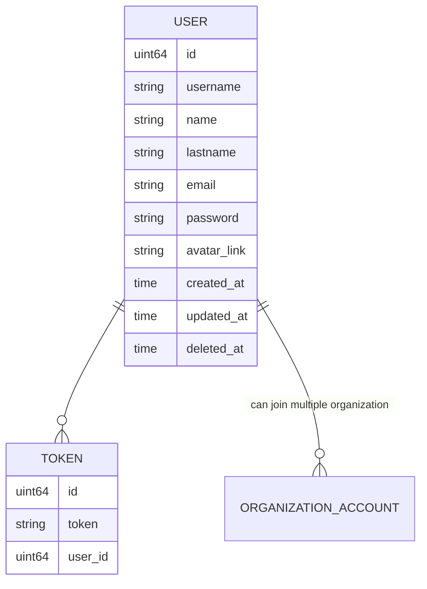
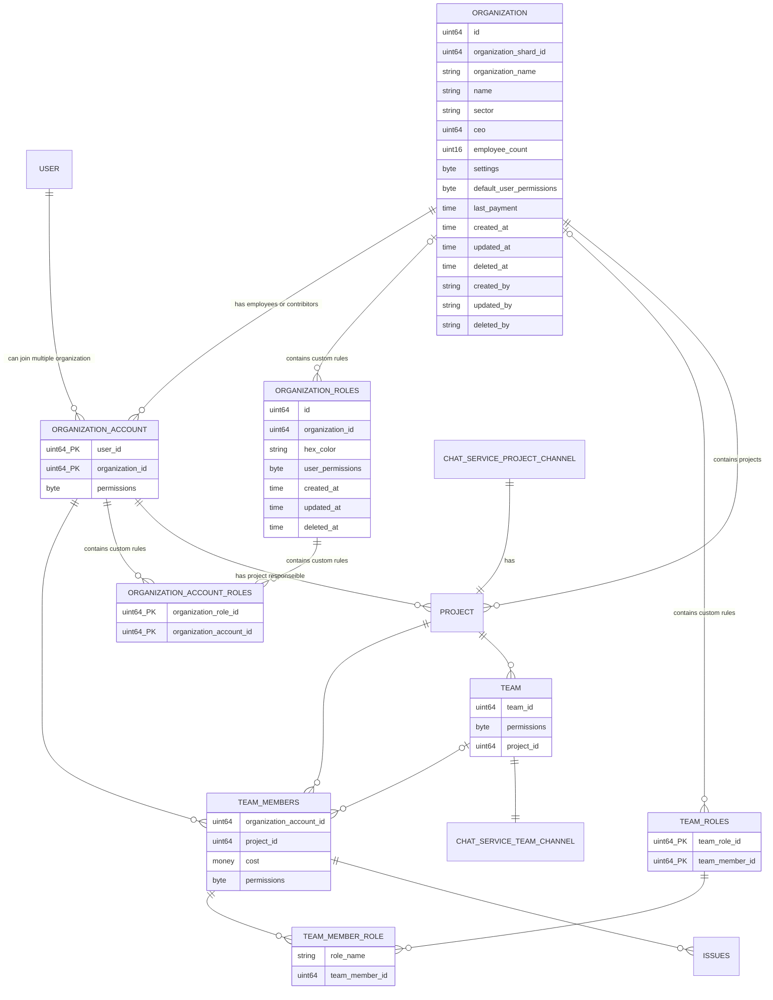
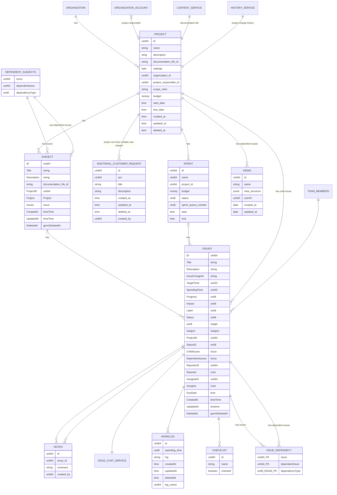

# Project Management System 

Project Management System is a tool that helps working with multiple project management methodologies. 


# Methodologies

The main inspiration for project management systems is project management methodologies.

# Agile Project Management

## Project Planing 
The end goal will be determined in the project description. But I think this shouldn't be plain text. We can use a md file for write a description. This description will include main project goals. And it can also include diagrams charts and images about the project. We save this description in CMS servise. Because description field works like wordpress website. For this reason we have a CMS service for pages and diagrams. Also in this stage, subjects(teams that working on specific field of the project) will be created. And empleeyes will be assigned for this subjects.  	  			
-  Every subject has an team leader. Team leader can only assign empoyees to a subject.
-  For assigning employees for a subject, employee   
must have been added by the organization. 
- If a user is directly connected to an organization and working for them, a user account will connect to the organization. User account and organization including many2many connections, due to a user can be working at one company and for its organization. 
- But at the same time user can have a side project with other people. For managing this project easily than can create another organization account. 
- From the project setting, they can make their project read-only for all users. If they want, they can give issue create permissions for external issues. These issues can be bugs or needing extra features. With this platform, the organization can easily manage user feedback. (Agile manifesto 3-4.  principle)
- Or you can create guest organization accounts only for customers. And customers can directly watch project development phases. And they can explain, if some pieces of application not fully understood. (Agile manifesto 3-4.  principle)
- Under organization with five users, it's free. But if it's more than that, a small price is needed monthly.
- Projects and subjects have their own chat channels. (Agile manifesto 1.  principle)

### Diagram of User Service Database (postgresql):

settings example: Work in progress limit, 

### Diagram of Organization Service Database (postgresql):



## Project Roadmap

Project roadmap will started created from project defination. Than Project Manager started to creating sprints, subjects and issues. After that project parts starts to create. Parts are project sub features can be belonging to subject and sprint. And this parts have isseues. Isseues can be added to parts after that parts are created.

Users will have personal workload feature

### Project: Organization Projects
- Name : Name of the project  [Min:1 Max:36 Required]
- Description: Summary of the project [Min:1,Max:255 Required]
- Documentation File: Detailed documentation of the project. It will be store project details with a basic CMS service. With using CMS service, user can create complex navigation structure around multiple files and contents. CMS service will create a folder for every project and create pages inside that.
- Project Settings: Settings of the project. It will store as binary format.
- Organization: Organization to which the project belongs
- Project Responsible : Super user of project. Has all create update and get permissions
- Start Date: Project planned start date
- Due Date: Project planned end date

### Sprint: Project Sprints
- Name: Defined name of sprint [Min:1 Max:36 Required]
- Project: Project to whichthe project belongs.
- Start: Sprint start time.
- End: Sprint end time
- Next Spirint
- Previous Sprint

### Subject: Substract part

|Project | Parent Subject | Subject | Parent Issue | Issue |Child Issues|
|-|-|-|-|-|-|
Project Management Application | Project Module | View System | View Creation Pages| Kanban View Creation Page | Kanban View Creation Page Design / Input Component Creation / Form Creation        |
|


Issue Dependecy Types : child of, blocker of,new version of, new feature of , Finish to start (FS), Finish to finish (FF), Start to start (SS), Start to finish (SF)
Subject Dependecy Types : child of, new version of, next stage of, Finish to start (FS), Finish to finish (FF), Start to start (SS), Start to finish (SF)

### View Slot System (Kanban, Gantt vs)
Every view has an predifined slot structures inside code. And user can define which parameters will be part of this structure. With an frontend interface user can design which parameters show where. Service will control this definations match with schema limitations, and save this structure as json format inside view structure. All keys are reserved and validated keywords.

#### Example Kanban View Format
```
{
	title : [
		project_issue_id
		issue_name
	]
	upright_corner: [
		assinie_image: url
		assignie_name
	],
	bottomright_corner : [
		due_date: 
		
	],
	bottomeleft_corner : [
	
	],
	line_percentage: {
		(total_checkount)
		(checked_check_count)
	}
	description_paper:{
		title : [
			project_issue_id
			issue_name,
		]

	}
	

}
```
#### Example List View Format
```
	column_list:[
		issue_name
		issue_due_date
		issue_priority
		etc...
	]
```

### Automation Service

Automation service will include trigger, control and effect properties. Trigger is describes to events starting the process. And effects describes the process after trigger happend. Every possible trigger and effect described inside code. Also triggers can connect each other "or" combiners. When trigger event published, target fields controlled by control layer. This layer includes chained statements by "and" or "or". After that mulpile effects can run if all controls passed. If automations are enabled, this automations added to automation service redis cache. When

#### Diagram of Automaton Service Database (mongodb):

```
{
	_id
	project_id
	triggers: []
	controls: []
	effects: []
}
```

#### Diagram of Project Service Database (postgresql):


### Project schema example (mongodb version)
```
project_collection:

{
  ...project_fields
  sprints: [
    {
      ...sprint_fields,
    }
  ],
  subjects: [
    {
      ...subject_fields,
      dependent_subjects: [{
        _id
        name
      }]
      dependent_issues: [{
        _id
        name
      }]
    }
  ],
  issues: [
    {
      _id
      ...issue_fields,
      dependent_issues: [{
        _id
        name
      }]
      subject : {
        _id
        name
      }
      sprintName: {
        _id
        name
      }
    },
    addtional_customer_requests: [{
	  id
      title 
      description
      crated_at
      updated_at
      deleted_at
      created_by
  }],
 
```

## Technical Notes

### User Permission System

When user logged in, user will get organization permissions from ORGANIZATION_ACCOUNT table and team permissions from TEAM_MEMBER table for  token. Also user will get defaut role permissions from TEAM_MEMBER_ROLE table
ORGANIZATION_ACCOUNT permissions.

rwud = read write update delete. chmod like permission system 
Examples:
 0010 = 2 update
 1100 = 12 read and write
 **Note:** write permission also can update if entity created by same user. But with update permission user can update another entitys wich created by another organization members.

- organizationID:0(issue):rwud - organization based global issue permissions
- organizationID:1(project):rwud - organization based global project permissions
- organizationID:2(subject):rwud - organization based global subject permissions- 
- organizationID:3(sprint):rwud - organization based global sprint permissions
- organizationID:4(organization):rwud - organization based global organization permissions

- projectID:0(issue):rwud - project based global issue permissions
- projectID:1(project):rwud - project based global project permissions
- projectID:2(subject):rwud - project based global subject permissions
- projectID:3(sprint):rwud - project based global sprint permissions

### Posgres scaling

We will scale project database by project based. Looks like this example https://www.notion.so/blog/sharding-postgres-at-notion

I decide to test sharding structure with 
|Physical db 1                          |Physical db 2       |
|-------------------------------|-----------------------------|
Logical Shard 1          | Logical Shard 1             |
Logical Shard 2              |Logical Shard 2            |
And also, i need to create shard mapping file for physical databases
drdkkan7uub4l -> project_shard_id -> 1
drdkkan7uub5l -> project_shard_id -> 2

When user getting permissions from organization service also get informantion of which shard includes organization projects. This information will be store inside the redis cache. If cache not include this data, user can get project_shard_id from organization service

## Chat Service Specs
- Every project and team has a chat group.
- Inside this chat groups members create sub channels for subjects or issue. 


## Content Service

Content Service is a service for project, subject or issue documentation.  This service can store markdown files as pages or nested pages.

### Shema of Content Service Pages (Mongodb)
documentation_collection example
```
{
	_id
	name
	pages: [{
		id
		name
		markdownFileSource
		pages:[{
			id
			name
			markdownFileSource
		}]
	}]
	createdAt
	updatedAt
	deletedAt
	createdBy
	updatedBy
	deletedBy
}
```

### Logger Service

Logger service will use mongodb for storing logs. With this way accesing log data will be more easy.  
Example general logging schema will be this way generally.
```
{
  level
  datetime
  request_id
  service_id
  user_id
  message_id
  (and more optional fields)
}
```
Every service and subparts will have their own collection.

### History Service 

This service is similar with logger service. But it includes less detail and data then user service. And stores data which we want to show users with history pages. Isseues, subjects, sprint and issues have history pages.

Example Issue History Collection:
```
{
  responsible_id
  responsible_name
  action
  date
}
```
