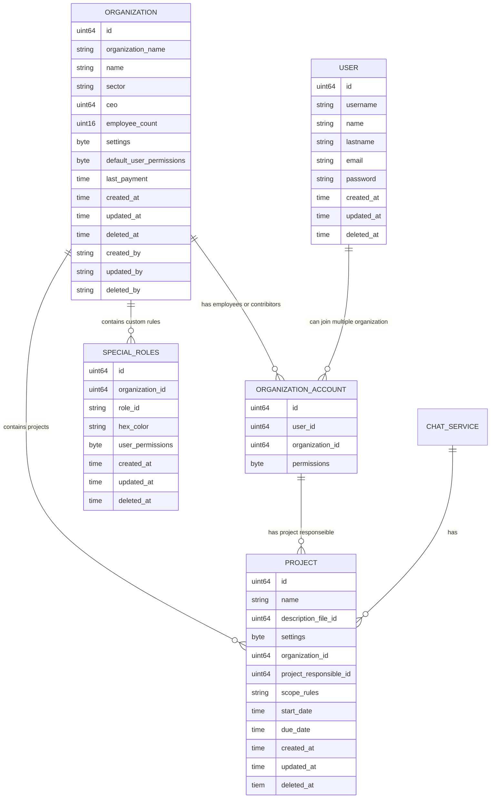
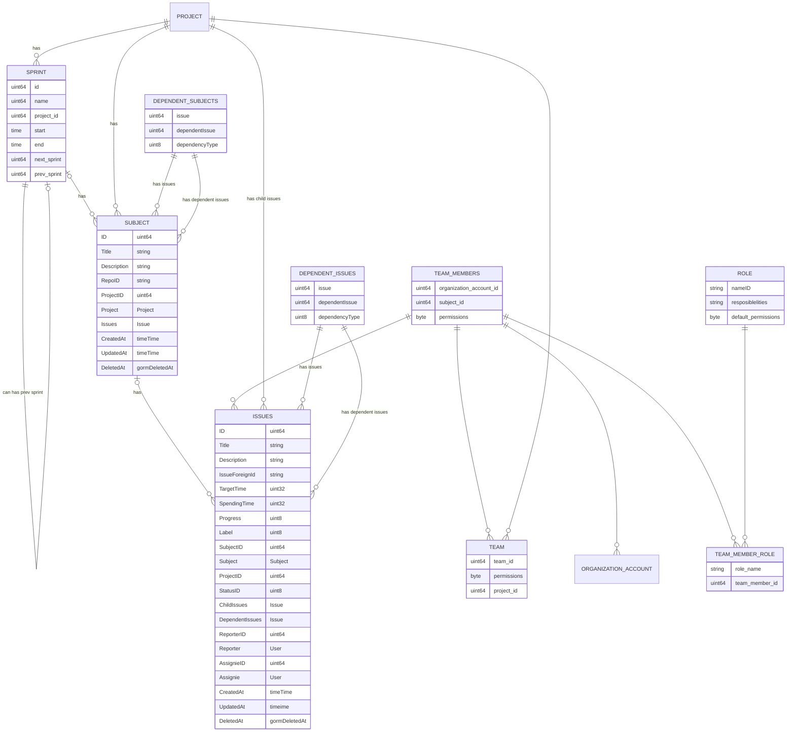

# Project Management System 

Project Management System is a tool that helps working with multiple project management methodologies. 

# Methodologies

The main inspiration for project management systems is project management methodologies.

## Agile Project Management

### Project Planing 
The end goal will be determined in the project description. But I think this shouldn't be plain text. We can use a md file for write a description. This description will include main project goals. And it can also include diagrams charts and images about the project. We save this description in CMS servise. Because description field works like wordpress website. For this reason we have a CMS service for pages and diagrams. Also in this stage, subjects(teams that working on specific field of the project) will be created. And empleeyes will be assigned for this subjects.  	  			
- Every subject has an team leader. Team leader can only assign empoyees to a subject.
-  For assigning employees for a subject, employee   
must have been added by the organization. 
- If a user is directly connected to an organization and working for them, a user account will connect to the organization. User account and organization including many2many connections, due to a user can be working at one company and for its organization. 
- But at the same time user can have a side project with other people. For managing this project easily than can create another organization account. 
- From the project setting, they can make their project read-only for all users. If they want, they can give issue create permissions for external issues. These issues can be bugs or needing extra features. With this platform, the organization can easily manage user feedback. (Agile manifesto 3-4.  principle)
- Or you can create guest organization accounts only for customers. And customers can directly watch project development phases. And they can explain, if some pieces of application not fully understood. (Agile manifesto 3-4.  principle)
- Under organization with five users, it's free. But if it's more than that, a small price is needed monthly.
- Projects and subjects have their own chat channels. (Agile manifesto 1.  principle)

### Project Roadmap

Project Roadmap will created by gantt diagram page. First, sprints will be defined. Than subjects will be created and users organization accounts will add inside of the subject. Than inside the sprints, issues starts to creating. And default status is backlog.

- Subjects are abstract parts about business rules. Example:
- Issues are technical parts of projects

Issue Dependecy Types : child of, blocker of,new version of, new feature of  
Subject Dependecy Types : child of, new version of, next stage of

### Technical Notes
#### User Permission System
When user logged in, user will get organization permissions from ORGANIZATION_ACCOUNT table and team permissions from TEAM_MEMBER table ( which effects issue creation ) to token. Also user will get defaut role permissions from TEAM_MEMBER_ROLE table
